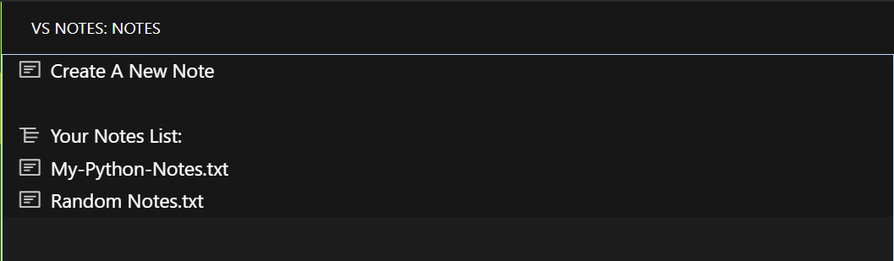
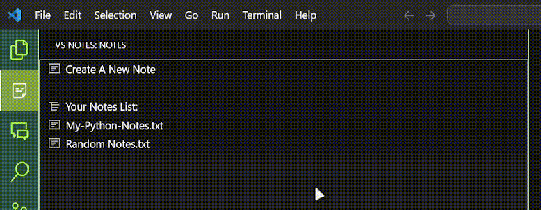

# VS-Notes

## Developer Information

### Developer

- **Name**: Dominic Minnich
- **GitHub**: [GitHub Profile URL](https://github.com/DomMinnich)

**VS-Notes** is a simple and intuitive note-taking extension for Visual Studio Code. It allows users to create, manage, and organize notes directly within the editor. Perfect for developers who need to jot down quick ideas, to-do lists, or project-related information without leaving the VS Code environment. Notes are stored globally, so they can be accessed across all projects in your VS Code environment.

## Features

- **Create Notes**: Quickly create new `.txt` notes by clicking the "New Note" button.
- **Manage Notes**: View, rename, and delete notes directly from the activity bar.
- **Quick Access**: All notes are accessible from the activity bar, making it easy to switch between your code and notes.
- **Persistent Notes**: Notes are stored globally, so they can be accessed across all projects in your VS Code environment.
- **Rename and Delete**: Click on any note to rename or delete it.

### Commands

- **New Note**: Ctr + Shift + P to bring up the command palette and type "Create A New Note" to create a new note.

### Screenshots

Here's how the VS-Notes extension looks in action:

#### Activity Bar Panel

#### Creating a New Note

#### Managing Notes (Rename and Delete)

> Tip: You can customize the look and behavior of the extension through VS Code's settings.

## Requirements

VS-Notes does not have any external dependencies. It works out of the box in any VS Code environment, but you should be using VS Code version `1.60.0` or higher to ensure compatibility.

## Extension Settings

VS-Notes does not currently add any additional settings, but future releases may include more customizable options such as note templates or custom note directories.

## How to Use

1. **Opening the Notes Panel**: Click the VS-Notes icon in the activity bar to open the notes panel.
2. **Creating a New Note**: Click on the "New Note" button, and you'll be prompted to give the note a name.
3. **Viewing Notes**: Click on any note from the list to open it in a new tab.
4. **Renaming Notes**: Right-click on any note and choose the "Rename" option. You will be prompted to enter a new name for the note (the `.txt` extension is handled automatically).
5. **Deleting Notes**: Right-click on any note and select "Delete" to remove it from your list.

## Known Issues

- **No Multi-File Support**: Currently, each note is created as an individual `.txt` file. Future updates may include support for other file types.
- **Cross-System Compatibility**: Notes are stored in the global storage location of VS Code, meaning they're specific to the VS Code environment and not synced across different machines automatically.

If you encounter any bugs or have feature requests, feel free to report them via the GitHub Issues page

## Release Notes

### 1.0.0

- Initial release of VS-Notes.
- Features: Create, rename, and delete notes from the activity bar.

## Following extension guidelines

Ensure that you've read through the extension guidelines and follow the best practices for creating your extension.

- [Extension Guidelines](https://code.visualstudio.com/api/references/extension-guidelines)

## Feedback and Contributions

If you’d like to contribute or provide feedback, feel free to open a pull request or issue on the GitHub repository.

---

## For more information

- [Visual Studio Code's Markdown Support](http://code.visualstudio.com/docs/languages/markdown)
- [Markdown Syntax Reference](https://help.github.com/articles/markdown-basics/)

**Enjoy using VS-Notes!**
